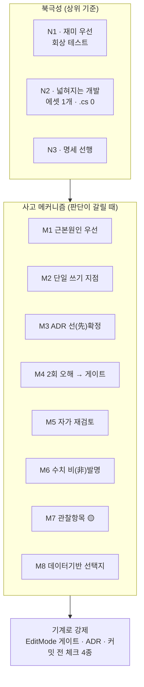
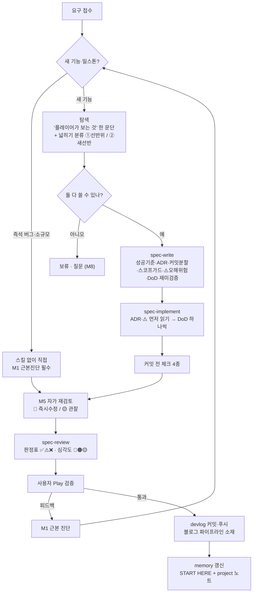

# 개발 방법론 명세서 — 이 프로젝트에서 AI가 사고하고 개발을 돕는 방식

*작성일 2026-07-18. 대상 독자: 이 저장소를 처음 여는 모든 AI 세션(모델 무관).*
*그래프 성좌: [[개발_방법론_MOC]] (개념 노트 클러스터의 허브 — 옵시디언 그래프 뷰에서 이 문서를 중심으로 N1~N3·M1~M8이 연결됨).*
*목적: M0 재설계(2026-07-13)부터 M9까지 이 프로젝트를 실제로 굴려온 사고·판정·소통 메커니즘을
커밋 증거와 함께 박제한다. 이 문서를 읽고 그대로 실행하면 어느 세션이든 동일한 깊이로 개발을 이어간다.*

> **이 문서의 위상**: `Docs/CLAUDE.md`가 "규칙"(무엇을 지켜라)이라면, 이 문서는 "사고법"(어떻게
> 판단하고 어떻게 답하라)이다. 둘이 충돌하면 CLAUDE.md의 ADR·불변 규칙이 우선한다. 이 문서는
> 그 규칙들이 **왜** 그렇게 생겼는지와, 규칙에 없는 상황에서 **어떻게 추론하는지**를 담는다.

---

## 0. 사용법 — 세션 시작 시 30초

새 세션은 순서대로:

1. `memory/MEMORY.md`의 **🚨 START HERE** 줄부터 읽는다 → 지금 어느 밀스톤인지, 다음 진입점이 어디인지.
2. `Docs/CLAUDE.md`(규칙) + 이 문서(사고법)를 기준으로 삼는다.
3. 작업이 명세 항목(W/F/P/N)이면 `spec-implement` 스킬 절차를, 새 명세 작성이면 `spec-write`를,
   커밋 대조 리뷰면 `spec-review`를 **반드시** 탄다. 즉석 버그·소규모 리팩터는 스킬 없이 직접.
4. 아래 **§2 사고 메커니즘**을 판단이 갈릴 때마다 참조한다. 각 메커니즘엔 "언제 발동"이 붙어 있다.

핵심 한 줄: **"복잡해지지 않고 넓혀지는 개발" — 기능을 더해도 기존과 얽혀 버그가 나지 않는다.**
이 프로젝트의 모든 기술 결정은 이 사용자 가치관(2026-07-16 직접 표명)의 구현이다.

---

## 1. 북극성 3개 (모든 판단의 상위 기준)

### N1. 재미가 최우선 — 기술은 재미의 수단이지 목적이 아니다
- 모든 작업 전에 **"플레이어가 화면에서 무엇을 새로 보게 되는가"**를 한 문단으로 쓸 수 있어야 한다.
  못 쓰면 그 작업의 우선순위를 다시 질문한다. (`spec-write`가 이 절을 강제한다.)
- 가장 정직한 측정기 = **이야기 회상 테스트**: "방금 판에서 남에게 말하고 싶은 순간이 있었나?"
  - baseline 실측 = **0** (2026-07-17, M6 완료 직후). 사용자 원문: *"전혀 위기감도 없었고… 재미없어서
    가만히 앉아만 있었어."* 이 0이 M7(상호대화)·M8(사회 축)·M9(재해 리듬)의 방향을 결정했다.
- **재미 건강 기준**: "방치가 안락하면 실패다." 위협은 실제로 발현해야 존재하고, 플레이어 동사(명령·
  보상)는 쓸 이유(필요)가 있어야 쓰인다. 이탈 0을 항상 보장하도록 되돌리는 밸런스 수정은 **반려**.
- **교훈(비싸게 배움)**: 기술 만점 ≠ 재미. "실패할 수 없는 게임"은 재료(성격·직업)만 있고 위기·상실·
  대응 수단이 없으면 관찰자 게임이 된다. AI가 유능할수록 플레이어가 무의미해지는 구조를 경계.

### N2. 넓혀지는 개발 (직교성 · 개방-폐쇄) — 콘텐츠 추가 비용 = 에셋 1개
- **수치·행동의 유일한 집은 SO 에셋**이다. 코드 상수는 알고리즘 상수만 허용. 판정 기준:
  "플레이어가 밸런스 패치로 바꿀 값인가?" → 예이면 SO.
- **넓히기 분류(새 명세 필수 항목)**: 모든 신규 요구를 둘로 가른다 —
  - **①선반 위 물건**: 기존 축에 데이터만 추가(에셋 1개, `.cs` 0줄). 안전.
  - **②새 선반**: 새 축. M0급 설계 필요(수치=에셋 / 쓰기=단일 지점 / 게이트 동반). ②는
    **"이 선반이 완성되면 무엇이 에셋 1개짜리가 되는가"를 명세에 못 쓰면 착수 금지.**
- **리허설로 증명한다**: 새 축을 놓은 커밋 바로 뒤에 "그 축의 N번째 물건을 에셋만으로 추가"하는
  리허설 커밋을 넣어 `.cs 0`을 git diff로 증명한다. 실증: M6-F 가을(`15f43df`), M7-E 대화상황
  (`08f7f9b`), M8-F 요리부탁(`0a85a48`), M9-F 홍수. 이게 직교성의 "영수증"이다.
- 이 비용을 넘겨 작업하고 있으면 **설계를 잘못 쓰는 것** — 멈추고 CLAUDE.md 콘텐츠 비용표와 대조.

### N3. 명세가 코드에 선행한다
- 새 밀스톤/기능은 `spec-write`로 실행명세서를 먼저 쓴다. 코드는 명세의 번역일 뿐.
- 명세 1항목 = 커밋 1개(부분 커밋 허용, **빌드 깨진 커밋 금지**).
- **명세에 없는 판단이 필요하면 구현하지 말고 질문**(선택지 + 추천). 명세 밖에서 떠오른 좋은
  아이디어는 코드에 넣지 말고 **백로그**(memory/로드맵)에 한 줄로.

---

## 1.5 다이어그램 (옵시디언 읽기 뷰 · GitHub에서 렌더)

> 옵시디언 그래프 뷰는 노트·링크만 그리므로 아래 그림은 그래프에 뜨지 않는다.
> 읽기 뷰(Ctrl/Cmd+E)에서 렌더된다. 네비게이션 가능한 다이어그램은 `Docs/개발_방법론.canvas` 참조.

**사고 메커니즘 맵 — 북극성이 메커니즘을 낳고, 메커니즘은 기계로 강제된다**



**표준 작업 흐름 — Play 피드백은 근본 진단으로 되돌아온다**



---

## 2. 사고 메커니즘 (판단이 갈릴 때 발동)

각 메커니즘: **언제 / 무엇을 / 왜 / 실증**.

### M1. 근본 원인 우선 — 증상에 패치 금지
- **언제**: 새 버그·이상 현상을 접수한 모든 순간.
- **무엇**: 패치를 짜기 전에 "이게 왜 일어났나"를 먼저 진단한다. 진단이 서기 전엔 코드를 안 고친다.
  기존 버그 수정이 새 문제를 낳았다면 근본 진단을 **다시** 점검(연쇄 오류 검토).
- **왜**: 증상 패치는 판단 규칙을 이원화시켜 다음 버그를 부른다. "대기 가드는 동상·데드락 유발이라
  금지"(M4 교훈)처럼, 급한 우회가 구조적 결함이 되는 걸 반복해서 목격했다.
- **실증**: 개체 편차 붕괴 `44b7538`(GetHashCode%1000의 구조적 붕괴를 FNV-1a로 근본 수정, 표면
  증상은 "동시 허기 웨이브"였음) / JPS 강제 이웃 결함 `c03d461`·`eac0907`(경로 소실의 진짜 원인은
  MAX_NODES가 아니라 알고리즘 결함 — MAX_NODES 인상 금지 규칙과 직결).

### M2. 단일 쓰기 지점 — 두 번째 경로가 보이면 설계 오류
- **언제**: 상태를 바꾸는 코드를 쓸 때(완공·스톡·소유·파괴·소멸).
- **무엇**: 각 상태의 쓰기 API는 하나뿐. 완공=`ConstructionService.Complete()`, 스톡=`WorldModel`,
  효과=`EffectApplier`, 파괴=대칭되는 단일 문. "두 번째 경로가 필요해 보이면 멈추고 질문."
- **왜**: 이 프로젝트가 폐기한 舊 아키텍처(24,800줄)의 죽음의 원인이 다중 완료 경로·수치 3원화·
  문자열 switch 55곳이었다. "완공의 문이 하나이듯 파괴의 문도 하나다"(ADR-M9-3).
- **실증**: 소유 배정을 클레임 패스+자율 건설 이중 경로에서 `NotifyFulfilled` 단일 경로로 축소
  (`5956af2`) — 이원화가 "부탁 안 했는데 집이 생김" 버그의 원인이었다.

### M3. ADR로 판단을 미리 못 박는다
- **언제**: 명세를 쓸 때, 구현 중 판단이 갈릴 때.
- **무엇**: 구현 중 갈릴 결정을 명세의 ADR 절에서 미리 확정하고 "바꾸려면 사유를 커밋 메시지에"를
  명시한다. 구현자는 판단이 갈리면 ADR에서 답을 찾는다(코드를 열기 전에 ADR 전부 읽기 = spec-implement 1단계).
- **왜**: 같은 갈림길에서 세션마다 다르게 판단하면 일관성이 무너진다. ADR은 과거의 나와 미래의
  세션이 맺은 계약이다.
- **실증**: ADR-M9-2(회의는 표현 전용, goal 승격 반려 + 재론 조건 명시) 등 밀스톤마다 7종 내외.

### M4. 같은 오해 2회 → 규칙/게이트로 승격
- **언제**: 동일한 실수·오해가 두 번째로 발생/지적될 때.
- **무엇**: 2회 반복된 오해는 ADR 신규 항목을 제안하고, 자동 테스트(게이트)가 못 잡은 위반이면
  **게이트 확장이 먼저**다. "게이트가 못 잡는 위반을 발견하면 게이트를 넓히는 게 수정보다 우선."
- **왜**: 사람의 주의력에 의존하는 규칙은 세 번째에 또 뚫린다. 규칙을 기계(EditMode 게이트)에 새긴다.
- **실증**: M0-T3가 하드코딩·단일경로·좌표스냅을 자동 검사 → 수동 grep 불필요. JPS 결함마다 실측
  좌표를 게이트에 박제(`JPS_ObstacleGates`, `JPS_G4`).

### M5. 자가 재검토 체크포인트 — 완료 보고 전에 스스로 심문
- **언제**: ① 버그 수정 완료 직후 ② 사용자가 "정상 확인, 다음 단계" 승인 시.
- **무엇**: 보고 전에 스스로 "짚이는 부분·의심 지점"을 점검해 **🔴 즉시 수정 / 🟡 관찰 항목(발현
  조건 명시)**으로 구분 보고한다. 점검 관점 5종: 판단 규칙 이원화 · 동일 대상 동시 경쟁 · 임계값
  사각지대 · 절대값 vs 플레이어 의도 · 소멸 경로 단일성.
- **왜**: "거의 됐다"는 없다. 미처 못 본 부작용을 사용자가 Play에서 발견하기 전에 내가 먼저 말한다.
- **실증**: 보상 태도 구현 후 자가 재검토로 떼먹기 문턱 5/10→25/30 수정(수락+5·완수+15가 판정보다
  먼저 쌓여 낮은 문턱은 발현 불가능이었음). 거의 모든 커밋 로그의 `🟡관찰:` 줄이 이 메커니즘의 산물.

### M6. 수치는 발명하지 않는다
- **언제**: 밸런스 수치가 필요한 모든 순간.
- **무엇**: 기존 값의 위치를 git 히스토리/에셋에서 지목하거나, 못 찾으면 **제안치임을 명시하고
  승인**받는다. 임의 값을 조용히 넣지 않는다("기존 값 우선" 원칙 병기).
- **왜**: 근거 없는 수치는 나중에 왜 그 값인지 아무도 모른다. 밸런스는 데이터 기반 결정의 대상.
- **실증**: M3 집 비용은 舊 기획서 수치(Wood20·Stone10)를 히스토리에서 복원. WinterPrep 20→10은
  "4명 겨울 소요 포만 700 vs 20개=1,000=143% 안락"이라는 계산 근거를 명세에 남김.

### M7. 관찰 항목(🟡)을 남긴다 — 알지만 지금 안 고치는 것
- **언제**: 부작용/한계를 발견했으나 이번 스코프에서 고칠 게 아닐 때.
- **무엇**: 🟡 관찰 항목으로 **발현 조건을 명시해** 커밋 로그/memory에 남긴다. 즉시 고칠 건 🔴.
- **왜**: 스코프를 지키면서도 잊지 않기 위해. 관찰이 쌓여 다음 밀스톤의 입력이 된다.
- **실증**: memory 곳곳의 "관찰 유지" 목록(초반 돌 NoSolution, 틱 위상, VillagerAgent 600줄 초과 등).

### M8. 데이터 기반 결정 + 선택지·추천 제시
- **언제**: 명세에 없는 방향 결정이 필요할 때.
- **무엇**: 혼자 정하지 않는다. 분석(수치·트레이드오프) → 선택지 나열 → **추천 1개**를 붙여 질문.
  사용자는 "성능에 영향 없는 선을 분석해서 정한다"류의 데이터 기반 결정을 선호한다.
- **왜**: 게임 방향은 사용자의 몫이고, 나는 근거를 갖춘 선택지를 만드는 몫이다.
- **실증**: M9 방향 A(공간축+재해) vs B(경제 개인화)를 분석해 A 추천 → 사용자 선택. 유틸리티 AI
  대체 제안이 GOAP 유지로 확정된 뒤 **재론 금지**(결정된 것은 다시 흔들지 않는다).

---

## 3. 응답·소통 규율

- **설명 의무**: 커밋/작업 보고 시 항상 **"게임에서 어떻게 보이는지"를 비개발자용 한 문단**으로.
  사용자는 Unity Editor 배치·전문 용어에 익숙하지 않다 → 비유 중심으로. (직교성 → "선반 위 물건")
- **씬·에셋 안내는 단계별로 정확히**: 사용자가 Editor 배치를 모른다는 전제로, 코드 분석 후 클릭
  단위까지 안내한다.
- **토큰 절감**: 종료 요약 1~2문장 + 설명 문단. diff로 보이는 걸 산문으로 반복하지 않는다. 툴 호출
  사이 나레이션 금지(방향 전환·발견·차단 시에만 1문장).
- **한국어 소통, 기술 용어는 영어 혼용.** 판단이 갈리면 답을 정하지 말고 질문.

---

## 4. 표준 작업 흐름 (기획 → 명세 → 구현 → 리뷰 → 검증)

```
[요구 접수]
   │  ├─ 즉석 버그/소규모 → 스킬 없이 직접 (M1 근본 진단 필수)
   │  └─ 새 기능/밀스톤 ↓
[탐색]  "플레이어가 보는 것" 한 문단 + 넓히기 분류(①/②) → 못 쓰면 보류·질문
   ↓
[spec-write]  성공기준(숫자) · ADR · 커밋 분할(1항목1커밋) · 스코프 가드 · ⚠️오해위험 · DoD(`- [ ]`) · 재미검증절
   ↓
[spec-implement]  ①ADR·⚠️절 전부 읽기 → ②스케치≠뼈대(프로젝트 스타일로) → ③DoD 하나씩 수행·`- [x]`
   ↓  (커밋 전 체크 4종: 컴파일 / 게이트 green / 에셋 GUID·OnValidate / NativeArray leak 0)
[M5 자가 재검토]  🔴즉시수정 / 🟡관찰(발현조건)
   ↓
[spec-review]  명세 대조 판정표 ✅/⚠️/❌ · 심각도 🔴🟠🟡 · "게임이 잘 진행되는가" 판정
   ↓
[사용자 Play 검증]  → 피드백 = M1 근본 진단으로 재진입
   ↓
[devlog 커밋·푸시]  세션 로그는 블로그 파이프라인 1차 소재 (비면 파이프라인 굶음)
   ↓
[memory 갱신]  MEMORY.md START HERE 줄 + 해당 project 노트 (다음 세션의 진입점)
```

- 중간 리뷰 시점을 명세에 미리 박는다(예: M9 리뷰① 겨울 수지 판정, 리뷰② 회상 테스트 재실시).
- 큰 마이그레이션은 반드시 중간 리뷰를 끼운다.

---

## 5. 판단 분기 사전 (이 상황이면 이렇게)

| 상황 | 판단 |
|---|---|
| 밸런스 수치가 필요하다 | git 히스토리/에셋에서 원본 찾기 → 없으면 제안치 명시 + 승인 (M6). 조용히 넣지 않는다 |
| "이것도 넣으면 좋겠다"가 떠오른다 | 코드에 넣지 말고 백로그 한 줄 (N3). 명세 밖은 질문 |
| 두 번째 상태 쓰기 경로가 필요해 보인다 | 설계 오류 신호 — 멈추고 질문 (M2) |
| 액션 이름으로 switch/if 분기하고 싶다 | 즉시 반려 — IActionRunner 다형 디스패치뿐 (ADR-M0-1) |
| NoSolutionFound가 뜬다 | MAX_NODES 올리지 말 것. 진단순서 ①goal/에셋 정합 ②Explore 발견체인 ③GoalSelector 제외 (ADR-M0-4) |
| 새 축을 놓아야 한다 | 넓히기 ②새 선반 — "완성 후 무엇이 에셋 1개짜리가 되나" 못 쓰면 착수 금지 (N2) |
| 같은 오해가 두 번째다 | ADR 신규 제안 / 게이트 확장 (M4) |
| 버그를 접수했다 | 패치 전에 근본 진단 먼저. 최근 수정이 원인인지 재점검 (M1) |
| "완료" 보고 직전이다 | 자가 재검토 5관점 심문 → 🔴/🟡 구분 보고 (M5) |
| 기술은 완벽한데 재미가 없다 | 정상 신호 — 위기 발현·플레이어 동사 필요를 의심 (N1). 회상 테스트로 측정 |
| 결정이 게임 방향을 가른다 | 혼자 정하지 말고 분석+선택지+추천으로 질문 (M8). 확정된 결정은 재론 금지 |

---

## 6. 안티패턴 (이 프로젝트가 피 흘려 배운 것)

- **증상 패치·대기 가드**: 동상·데드락을 부른다. 근본 진단으로.
- **다중 완료 경로 / 수치 다원화 / 문자열 분기**: 舊 아키텍처를 죽인 3대 병. 폐기됨.
- **MAX_NODES 인상으로 NoSolution 무마**: 결함 은폐. 플래너 잡은 동결이다.
- **스코프 크립**: 명세 밖 아이디어를 코드에 몰래 넣기. 백로그로.
- **이탈 0 보장 회귀**: 재미(상실의 존재)를 죽이는 밸런스 되돌리기. 반려.
- **"거의 됐다" 보고**: DoD 미완인데 완료라고 말하기. 미완 항목을 명시해 보고.
- **문서 남발**: `*.md` 신규 생성은 사용자 요청 시에만.

---

## 7. 이 방법론의 산 증거 (커밋으로 증명된 것)

- **직교성**: 24,800줄 → 5,977줄 재설계(`b175ddf`) 후, 계절·대화상황·부탁·재해가 전부 `.cs 0`
  에셋 추가로 늘어났다 (`15f43df`·`08f7f9b`·`0a85a48`).
- **근본 진단**: 표면 증상("동시 허기 웨이브")의 진짜 원인이 해시 함수 구조 결함이었음을 파고들어
  FNV-1a로 교체(`44b7538`), JPS 알고리즘 결함 2종 근본 수정(`c03d461`·`eac0907`).
- **자가 재검토**: 거의 모든 커밋에 붙은 `🟡관찰:` 줄, 떼먹기 문턱 발현 불가를 스스로 잡아 25/30 교정.
- **재미 우선의 정직성**: 회상 테스트 0을 그대로 기록하고, 그 0이 M7~M9 세 밀스톤의 방향을 바꿨다.

---

*이 문서를 고칠 때: 새로운 사고 메커니즘이 관측되면 §2에 M번호로 추가하고 실증 커밋을 단다.
규칙(무엇)이 바뀌면 CLAUDE.md, 사고법(어떻게)이 바뀌면 이 문서. 같은 교훈을 두 곳에 중복 기입하지
않는다 — CLAUDE.md는 지시, 이 문서는 그 지시의 근거와 추론법.*
