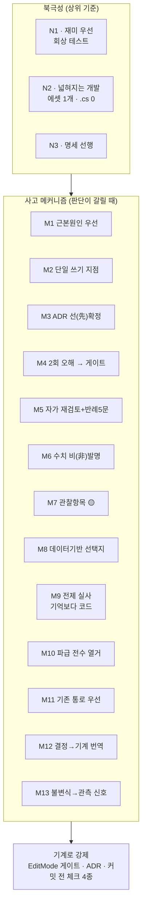
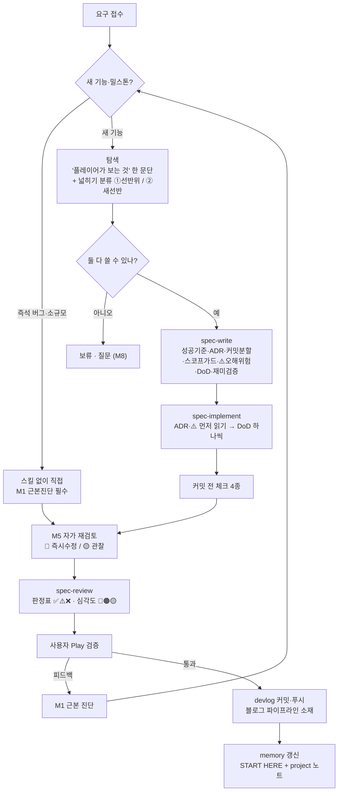

# 개발 방법론 명세서 — 이 프로젝트에서 AI가 사고하고 개발을 돕는 방식

*작성일 2026-07-18. 개정 2026-07-23 (M9~M13 메커니즘·실사 체크리스트 추가 — M10·M11 명세
세션에서 관측된 사고 패턴 박제. 목적: 어느 모델이 이어받아도 같은 절차로 같은 깊이가 나오게).*
*개정 2026-08-01: **M17(수치의 짝)** 신설 + M1에 "개입 지점 선택" 항목 추가 — M16 화폐
밸런스 조정에서 값의 짝을 안 세는 실수를 3회 반복해 전원 아사에 이른 사고의 박제.*
*대상 독자: 이 저장소를 처음 여는 모든 AI 세션(모델 무관).*
*그래프 성좌: [[개발_방법론_MOC]] (개념 노트 클러스터의 허브 — 옵시디언 그래프 뷰에서 이 문서를 중심으로 N1~N3·M1~M8이 연결됨).*
*목적: M0 재설계(2026-07-13)부터 M9까지 이 프로젝트를 실제로 굴려온 사고·판정·소통 메커니즘을
커밋 증거와 함께 박제한다. 이 문서를 읽고 그대로 실행하면 어느 세션이든 동일한 깊이로 개발을 이어간다.*

> **이 문서의 위상**: `Docs/CLAUDE.md`가 "규칙"(무엇을 지켜라)이라면, 이 문서는 "사고법"(어떻게
> 판단하고 어떻게 답하라)이다. 둘이 충돌하면 CLAUDE.md의 ADR·불변 규칙이 우선한다. 이 문서는
> 그 규칙들이 **왜** 그렇게 생겼는지와, 규칙에 없는 상황에서 **어떻게 추론하는지**를 담는다.

---

## 0. 사용법 — 세션 시작 시 30초

새 세션은 순서대로:

1. `memory/MEMORY.md`의 **🚨 START HERE** 줄부터 읽는다 → 지금 어느 밀스톤인지, 다음 진입점이 어디인지.
2. `Docs/CLAUDE.md`(규칙) + 이 문서(사고법)를 기준으로 삼는다.
3. 작업이 명세 항목(W/F/P/N)이면 `spec-implement` 스킬 절차를, 새 명세 작성이면 `spec-write`를,
   커밋 대조 리뷰면 `spec-review`를 **반드시** 탄다. 즉석 버그·소규모 리팩터는 스킬 없이 직접.
4. 아래 **§2 사고 메커니즘**을 판단이 갈릴 때마다 참조한다. 각 메커니즘엔 "언제 발동"이 붙어 있다.

핵심 한 줄: **"복잡해지지 않고 넓혀지는 개발" — 기능을 더해도 기존과 얽혀 버그가 나지 않는다.**
이 프로젝트의 모든 기술 결정은 이 사용자 가치관(2026-07-16 직접 표명)의 구현이다.

---

## 1. 북극성 3개 (모든 판단의 상위 기준)

### N1. 재미가 최우선 — 기술은 재미의 수단이지 목적이 아니다
- 모든 작업 전에 **"플레이어가 화면에서 무엇을 새로 보게 되는가"**를 한 문단으로 쓸 수 있어야 한다.
  못 쓰면 그 작업의 우선순위를 다시 질문한다. (`spec-write`가 이 절을 강제한다.)
- 가장 정직한 측정기 = **이야기 회상 테스트**: "방금 판에서 남에게 말하고 싶은 순간이 있었나?"
  - baseline 실측 = **0** (2026-07-17, M6 완료 직후). 사용자 원문: *"전혀 위기감도 없었고… 재미없어서
    가만히 앉아만 있었어."* 이 0이 M7(상호대화)·M8(사회 축)·M9(재해 리듬)의 방향을 결정했다.
- **재미 건강 기준**: "방치가 안락하면 실패다." 위협은 실제로 발현해야 존재하고, 플레이어 동사(명령·
  보상)는 쓸 이유(필요)가 있어야 쓰인다. 이탈 0을 항상 보장하도록 되돌리는 밸런스 수정은 **반려**.
- **교훈(비싸게 배움)**: 기술 만점 ≠ 재미. "실패할 수 없는 게임"은 재료(성격·직업)만 있고 위기·상실·
  대응 수단이 없으면 관찰자 게임이 된다. AI가 유능할수록 플레이어가 무의미해지는 구조를 경계.

### N2. 넓혀지는 개발 (직교성 · 개방-폐쇄) — 콘텐츠 추가 비용 = 에셋 1개
- **수치·행동의 유일한 집은 SO 에셋**이다. 코드 상수는 알고리즘 상수만 허용. 판정 기준:
  "플레이어가 밸런스 패치로 바꿀 값인가?" → 예이면 SO.
- **넓히기 분류(새 명세 필수 항목)**: 모든 신규 요구를 둘로 가른다 —
  - **①선반 위 물건**: 기존 축에 데이터만 추가(에셋 1개, `.cs` 0줄). 안전.
  - **②새 선반**: 새 축. M0급 설계 필요(수치=에셋 / 쓰기=단일 지점 / 게이트 동반). ②는
    **"이 선반이 완성되면 무엇이 에셋 1개짜리가 되는가"를 명세에 못 쓰면 착수 금지.**
- **중립 불변식**: 새 필드·슬롯·서비스의 **기본값은 반드시 "기존 동작과 diff 0"**이어야 한다.
  (필드 미설정=1f/0/null, 목록 비움=기능 없음, 미배선=舊 밀스톤 동작.) 확장이 기존 판을 흔들면
  넓히기가 아니라 얽히기다. 모든 밀스톤의 S 기준에 "비우면 이전 밀스톤과 동일" 항목이 있는 이유.
- **리허설로 증명한다**: 새 축을 놓은 커밋 바로 뒤에 "그 축의 N번째 물건을 에셋만으로 추가"하는
  리허설 커밋을 넣어 `.cs 0`을 git diff로 증명한다. 실증: M6-F 가을(`15f43df`), M7-E 대화상황
  (`08f7f9b`), M8-F 요리부탁(`0a85a48`), M9-F 홍수. 이게 직교성의 "영수증"이다.
- 이 비용을 넘겨 작업하고 있으면 **설계를 잘못 쓰는 것** — 멈추고 CLAUDE.md 콘텐츠 비용표와 대조.

### N3. 명세가 코드에 선행한다
- 새 밀스톤/기능은 `spec-write`로 실행명세서를 먼저 쓴다. 코드는 명세의 번역일 뿐.
- 명세 1항목 = 커밋 1개(부분 커밋 허용, **빌드 깨진 커밋 금지**).
- **명세에 없는 판단이 필요하면 구현하지 말고 질문**(선택지 + 추천). 명세 밖에서 떠오른 좋은
  아이디어는 코드에 넣지 말고 **백로그**(memory/로드맵)에 한 줄로.

---

## 1.5 다이어그램 (옵시디언 읽기 뷰 · GitHub에서 렌더)

> 옵시디언 그래프 뷰는 노트·링크만 그리므로 아래 그림은 그래프에 뜨지 않는다.
> 읽기 뷰(Ctrl/Cmd+E)에서 렌더된다. 네비게이션 가능한 다이어그램은 `Docs/개발_방법론.canvas` 참조.

**사고 메커니즘 맵 — 북극성이 메커니즘을 낳고, 메커니즘은 기계로 강제된다**



**표준 작업 흐름 — Play 피드백은 근본 진단으로 되돌아온다**



---

## 2. 사고 메커니즘 (판단이 갈릴 때 발동)

각 메커니즘: **언제 / 무엇을 / 왜 / 실증**.

> ⚠️ 메커니즘 번호(M1~M20)는 **밀스톤 번호(M0~M22)와 무관한 별개 체계**다. 혼동 금지.
> M1~M8은 M0~M8 밀스톤기(2026-07-18 박제), M9~M13은 M10~M11 명세기(2026-07-23 박제),
> M14~M15는 M12 종료·M13 브레인스토밍기(2026-07-26~27 박제)에 관측됐다.
> **M16은 블로그 자동화 파이프라인 점검기(2026-07-28 박제)** — 게임 코드가 아닌 곳에서
> 나왔지만, "다른 실행 주체에게 의무를 부과할 때"라면 어디서든 발동한다.
> **M17은 M16(화폐) 밸런스 조정기(2026-08-01 박제)** — 같은 실수를 한 세션에 3회 반복하고
> 그 세 번째가 **전원 아사**를 만든 뒤에 생겼다. M1에도 같은 날 항목이 하나 추가됐다
> (원인을 찾았어도 **개입 지점**은 여러 개다).

### M1. 근본 원인 우선 — 증상에 패치 금지
- **언제**: 새 버그·이상 현상을 접수한 모든 순간.
- **무엇**: 패치를 짜기 전에 "이게 왜 일어났나"를 먼저 진단한다. 진단이 서기 전엔 코드를 안 고친다.
  기존 버그 수정이 새 문제를 낳았다면 근본 진단을 **다시** 점검(연쇄 오류 검토).
- **왜**: 증상 패치는 판단 규칙을 이원화시켜 다음 버그를 부른다. "대기 가드는 동상·데드락 유발이라
  금지"(M4 교훈)처럼, 급한 우회가 구조적 결함이 되는 걸 반복해서 목격했다.
- **실증**: 개체 편차 붕괴 `44b7538`(GetHashCode%1000의 구조적 붕괴를 FNV-1a로 근본 수정, 표면
  증상은 "동시 허기 웨이브"였음) / JPS 강제 이웃 결함 `c03d461`·`eac0907`(경로 소실의 진짜 원인은
  MAX_NODES가 아니라 알고리즘 결함 — MAX_NODES 인상 금지 규칙과 직결).
- **🔑 원인을 찾았어도 개입 지점은 여러 개다 — 가장 작은 것을 고른다** (2026-08-01 추가):
  진단이 맞아도 **어디를 고칠지**가 또 하나의 선택이며, 여기서 틀리면 다른 것이 부서진다.
  실증: "집이 없으면 모닥불도 조리도 못 해 아사한다"까지 정확히 진단하고서 고칠 지점을
  **모닥불의 배치**(집 없으면 제자리에 짓기)로 잡았다 → 아사는 멎었지만 모닥불이 마을
  곳곳에 흩어져 배치가 무너졌다(`046ba3c` → 되돌림). 실사해 보니 앵커 조회가 이미 "내 것
  없으면 최근접"을 지원했고, 막던 것은 **액션 전제 한 줄**(`MyHasCampfire == 1` →
  `CampfireCount ≥ 1`)이었다(`34ecf73`). **점검 문장**: "이 증상을 만드는 **최소** 지점은
  어디인가? 내가 지금 고치려는 곳보다 더 안쪽에 스위치가 있지 않은가?"

### M2. 단일 쓰기 지점 — 두 번째 경로가 보이면 설계 오류
- **언제**: 상태를 바꾸는 코드를 쓸 때(완공·스톡·소유·파괴·소멸).
- **무엇**: 각 상태의 쓰기 API는 하나뿐. 완공=`ConstructionService.Complete()`, 스톡=`WorldModel`,
  효과=`EffectApplier`, 파괴=대칭되는 단일 문. "두 번째 경로가 필요해 보이면 멈추고 질문."
- **왜**: 이 프로젝트가 폐기한 舊 아키텍처(24,800줄)의 죽음의 원인이 다중 완료 경로·수치 3원화·
  문자열 switch 55곳이었다. "완공의 문이 하나이듯 파괴의 문도 하나다"(ADR-M9-3).
- **실증**: 소유 배정을 클레임 패스+자율 건설 이중 경로에서 `NotifyFulfilled` 단일 경로로 축소
  (`5956af2`) — 이원화가 "부탁 안 했는데 집이 생김" 버그의 원인이었다.

### M3. ADR로 판단을 미리 못 박는다
- **언제**: 명세를 쓸 때, 구현 중 판단이 갈릴 때.
- **무엇**: 구현 중 갈릴 결정을 명세의 ADR 절에서 미리 확정하고 "바꾸려면 사유를 커밋 메시지에"를
  명시한다. 구현자는 판단이 갈리면 ADR에서 답을 찾는다(코드를 열기 전에 ADR 전부 읽기 = spec-implement 1단계).
- **왜**: 같은 갈림길에서 세션마다 다르게 판단하면 일관성이 무너진다. ADR은 과거의 나와 미래의
  세션이 맺은 계약이다.
- **실증**: ADR-M9-2(회의는 표현 전용, goal 승격 반려 + 재론 조건 명시) 등 밀스톤마다 7종 내외.

### M4. 같은 오해 2회 → 규칙/게이트로 승격
- **언제**: 동일한 실수·오해가 두 번째로 발생/지적될 때.
- **무엇**: 2회 반복된 오해는 ADR 신규 항목을 제안하고, 자동 테스트(게이트)가 못 잡은 위반이면
  **게이트 확장이 먼저**다. "게이트가 못 잡는 위반을 발견하면 게이트를 넓히는 게 수정보다 우선."
- **왜**: 사람의 주의력에 의존하는 규칙은 세 번째에 또 뚫린다. 규칙을 기계(EditMode 게이트)에 새긴다.
- **실증**: M0-T3가 하드코딩·단일경로·좌표스냅을 자동 검사 → 수동 grep 불필요. JPS 결함마다 실측
  좌표를 게이트에 박제(`JPS_ObstacleGates`, `JPS_G4`).

### M5. 자가 재검토 체크포인트 — 완료 보고 전에 스스로 심문
- **언제**: ① 버그 수정 완료 직후 ② 사용자가 "정상 확인, 다음 단계" 승인 시.
- **무엇**: 보고 전에 스스로 "짚이는 부분·의심 지점"을 점검해 **🔴 즉시 수정 / 🟡 관찰 항목(발현
  조건 명시)**으로 구분 보고한다. 점검 관점 5종: 판단 규칙 이원화 · 동일 대상 동시 경쟁 · 임계값
  사각지대 · 절대값 vs 플레이어 의도 · 소멸 경로 단일성.
- **설계 시점 확장 (2026-07-23)**: 완료 후만이 아니라 **설계·명세를 쓰는 도중에도** 자기 설계를
  공격한다 — 반례 5문: ① 구현자/플래너가 이 규칙을 가장 그럴듯하게 **오해**하면 어떻게 되나?
  ② 두 주체가 **동시에** 하면? ③ 값이 0·상한·**대상 부재·사망**이면? ④ 이 규칙을 **악용**해
  영원히 사는/버티는/무한 반복하는 방법이 있나? ⑤ 이대로 12일 **방치**하면 화면에 뭐가 보이나?
  — 명세의 ⚠️오해위험 절은 이 심문의 산출물이다 (문항 ①), "교대 간호로 영원히 살리기" 차단
  (M11-I, 문항 ④), "플래너가 집에 둔 식량을 들판에서 먹는 계획" 차단(몸/집 슬롯 분리, 문항 ①)이 실례.
- **왜**: "거의 됐다"는 없다. 미처 못 본 부작용을 사용자가 Play에서 발견하기 전에 내가 먼저 말한다.
- **실증**: 보상 태도 구현 후 자가 재검토로 떼먹기 문턱 5/10→25/30 수정(수락+5·완수+15가 판정보다
  먼저 쌓여 낮은 문턱은 발현 불가능이었음). 거의 모든 커밋 로그의 `🟡관찰:` 줄이 이 메커니즘의 산물.

### M6. 수치는 발명하지 않는다
- **언제**: 밸런스 수치가 필요한 모든 순간.
- **무엇**: 기존 값의 위치를 git 히스토리/에셋에서 지목하거나, 못 찾으면 **제안치임을 명시하고
  승인**받는다. 임의 값을 조용히 넣지 않는다("기존 값 우선" 원칙 병기).
- **왜**: 근거 없는 수치는 나중에 왜 그 값인지 아무도 모른다. 밸런스는 데이터 기반 결정의 대상.
- **실증**: M3 집 비용은 舊 기획서 수치(Wood20·Stone10)를 히스토리에서 복원. WinterPrep 20→10은
  "4명 겨울 소요 포만 700 vs 20개=1,000=143% 안락"이라는 계산 근거를 명세에 남김.

### M7. 관찰 항목(🟡)을 남긴다 — 알지만 지금 안 고치는 것
- **언제**: 부작용/한계를 발견했으나 이번 스코프에서 고칠 게 아닐 때.
- **무엇**: 🟡 관찰 항목으로 **발현 조건을 명시해** 커밋 로그/memory에 남긴다. 즉시 고칠 건 🔴.
- **왜**: 스코프를 지키면서도 잊지 않기 위해. 관찰이 쌓여 다음 밀스톤의 입력이 된다.
- **실증**: memory 곳곳의 "관찰 유지" 목록(초반 돌 NoSolution, 틱 위상, VillagerAgent 600줄 초과 등).

### M8. 데이터 기반 결정 + 선택지·추천 제시
- **언제**: 명세에 없는 방향 결정이 필요할 때.
- **무엇**: 혼자 정하지 않는다. 분석(수치·트레이드오프) → 선택지 나열 → **추천 1개**를 붙여 질문.
  사용자는 "성능에 영향 없는 선을 분석해서 정한다"류의 데이터 기반 결정을 선호한다.
- **왜**: 게임 방향은 사용자의 몫이고, 나는 근거를 갖춘 선택지를 만드는 몫이다.
- **실증**: M9 방향 A(공간축+재해) vs B(경제 개인화)를 분석해 A 추천 → 사용자 선택. 유틸리티 AI
  대체 제안이 GOAP 유지로 확정된 뒤 **재론 금지**(결정된 것은 다시 흔들지 않는다).

### M9. 전제 실사 — 기억·메모리·기획서보다 코드가 진실
- **언제**: 명세·설계 착수 직전 (spec-write 0단계), 버그 진단 착수 시. **"이건 당연히 이렇겠지"가
  떠오르는 모든 순간이 발동 신호다.**
- **무엇**: 설계가 딛고 설 전제를 전부 나열하고, 하나씩 실제 코드를 Read/Grep으로 **확인한 뒤**
  설계를 시작한다. 어긋난 전제는 명세 서두 **"전제 확인 (코드 실사 결과)"** 절에 박제 — 이 절이
  없는 명세는 미완성이다. memory·기획서·과거 세션 요약은 낡을 수 있다; 코드만이 현재형이다.
  실사에서 memory가 틀렸음이 확인되면 **memory도 그 자리에서 정정**한다.
- **왜**: 전제가 하나 틀리면 그 위의 설계 전체가 공중에 뜬다. 실사 비용(파일 Read 수십 회)은
  잘못된 명세로 구현·되돌리기를 반복하는 비용의 수십 분의 일이다. 요구 텍스트만 보고 명세부터
  쓰는 것이 이 프로젝트에서 가장 경계하는 작업 방식이다.
- **실증**: M10 명세 실사 — "Medic·Warrior 직업이 존재"한다는 memory 전제가 틀렸음을 발견
  (VRD_*는 舊 고아 에셋, 코드 참조 0건) → Job_Medic 신설·FleeRadiusMult 설계로 방향 전환.
  M11 명세 실사 3건 — ① 부탁은 goal이 아니라 RequestService 스캔(→ "집 동기 goal"의 실체를
  부탁 에셋 조건+저축 goal로 번역) ② FleeRunner는 이미 내 집 우선(→ 노숙 폴백만 교체로 축소)
  ③ 거절 쿨다운은 이미 비영구(→ "영구 거절 방지" 요구를 여력 조건 설계로 정확화). 셋 다
  실사 없이는 틀린 명세가 나왔다.

### M10. 파급 전수 열거 — 의미가 바뀌면 참조를 센다
- **언제**: 슬롯·필드·함수의 **의미·단위·소유가 바뀔 때** (이름이 같아도 뜻이 달라지는 변경).
- **무엇**: 그 심볼의 소비자를 Grep으로 **전수** 나열하고, 명세에 "참조 개편 표"(어느 goal·HUD·
  게이트가 어떤 값으로 재보정되는가)를 만든 뒤에 바꾼다. "컴파일이 통과하면 끝"이 아니다 —
  의미 변경은 컴파일러가 못 잡는다 (특히 에셋의 SlotCondition·게이트의 기대값).
- **왜**: 마을 합산이던 값이 개인 값이 되면 같은 임계 4가 완전히 다른 게임이 된다. 참조를 안 세면
  "정의는 바꿨는데 소비자는 옛 뜻으로 읽는" 반쪽 전환이 남는다.
- **실증**: M11-D — FoodDaysLeft(슬롯 19) 개인 전환 시 Goal_Plant·WinterPrep·CookAhead·
  CookExtra·HUD·게이트를 전수 열거하고 §4.3 환산표로 재보정. 반례(비싸게 배움): M9 가을
  RegenMult — "재생만 막고 기존 노드 잔량 채집은 못 막는다"는 파급을 늦게 세어 겨울 억제
  지렛대가 가을에 있음을 관측 후에야 발견(`bc18e15`). 반례 2: M11-B 슬롯 교체 때 에셋
  소비자만 세고 **그 의미를 하드코딩한 舊 게이트 기대값**(실제 카탈로그를 로드하는 플래너
  스모크 테스트)을 빠뜨려 red 3건 — 전수 목록에는 에셋·코드·**테스트 기대값**이 모두
  들어간다(`2807386`). 반례 3 (2026-08-05, M20-W12): 에셋 삭제 때 **이름 grep만** 하면
  **값·타입 기반 스캔 게이트**(`FindAssets("t:RequestSO")` 순회·개수 하한 단언)를 못
  찾는다 — 삭제 대상의 이름이 게이트 어디에도 없기 때문이다. red 2건(M12_T3 고정 하한
  24 / M19_T2 "집 소유 배정 부탁 ≥ 1"). 처방 = 삭제 파급은 **게이트 → 대상 역방향**으로도
  훑는다: 그 타입을 순회하거나 그 종류의 개수를 세는 테스트를 전수 확인. 고정 개수 하한은
  가능하면 파생식(전체 − 면제)으로 바꿔 다시 낡지 않게 한다.
- ⚠️ **발동 조건 주의**: 이 메커니즘은 "의미가 바뀔 때"가 방아쇠라, **뜻은 그대로고 숫자만
  바꾸는 밸런스 변경**은 여기서 새어 나간다. 그 경우는 **M17**을 쓴다.

### M11. 기존 통로 우선 — 새 축을 놓기 전에 "누가 이미 이걸 나르는가"
- **언제**: 새 요구가 새 서비스·새 goal 체계·새 필드를 원하는 것처럼 보일 때.
- **무엇**: 코드에서 **같은 종류의 짐을 이미 나르는 통로**를 먼저 찾는다 — 이벤트(FireScene),
  판정 대역(RequesterConditions=goal 조건과 같은 언어), 러너 패턴(앵커 이동), 파생 슬롯 패턴
  (ADR-M9-9). 새 통로는 기존 통로가 **정말 못 나를 때만** 만들고, 그때는 넓히기 ②(새 선반)로
  정식 설계한다. 기존 통로 재사용은 검증도 공짜로 얻는다 (그 통로의 게이트·Play 이력이 자산).
- **왜**: 통로가 늘수록 판단 규칙이 이원화된다(M2의 사전 차단). 舊 아키텍처의 죽음 = 통로 55개.
- **실증**: M9 조리 위기 분화를 새 배율 대신 기존 CrisisActive 슬롯 재사용으로(`07a8bec`) /
  M11 집들이 = FarmMeeting의 FireScene 재사용(에셋 교체 수준) / 집 저장 = ConsumeActionSO
  앵커 이동 재사용(러너 신설 0) / 집값 여력 = RequesterConditions 재사용(새 판정 체계 0).
  M11 결정 16항이 새 서비스 2개(HomeStorage·HomePicker)로 흡수된 이유가 이 메커니즘이다.

### M12. 결정을 기계로 번역해 모순을 사전 탐지
- **언제**: 사용자 결정·아이디어를 받은 직후, 명세에 적기 전.
- **무엇**: 결정을 **슬롯·쓰기 지점·플래너 시야·수치 관계식**으로 번역해 본다 — "이 결정이
  자료구조가 되면 무엇이 필요한가, 어떤 값 관계가 성립해야 하나". 번역 중 드러나는 데드락·
  순환·시야 구멍·숨은 비용을 **정제 N건**으로 사용자에게 되돌려 확인받고 명세에 넣는다.
  결정을 거절하는 게 아니라 결정이 실제로 작동하게 만드는 번역이다.
- **왜**: 자연어 결정은 기계 제약을 모른다. 번역 없이 그대로 적으면 구현 단계에서 모순이
  터지고, 그때의 즉석 판단은 사용자 의도에서 멀어진다.
- **실증**: M11 착수일 — "자원 모이면 집 요구" 결정을 번역하다가 **집 보상액 > 몸 소지 상한이면
  영구 노숙 데드락**을 발견해 "보상 ≤ 상한 70%" 제약으로 정제(사용자 승인). "몸 소지+집 저장"
  결정을 슬롯으로 번역하다가 **플래너가 집에 둔 식량을 들판에서 먹는 시야 구멍**을 발견해 몸/집
  슬롯 분리 확정. "개인 밭" 결정의 숨은 비용(슬롯 3개 추가)도 이 번역이 드러냈다.

### M13. 불변식을 관측 신호로 — 로그 0건이 증명이 되게
- **언제**: 명세의 성공 기준(S)·DoD를 쓸 때.
- **무엇**: "누락·회귀가 생기면 **어디에 어떻게 보이는가**"를 먼저 설계한다. 불변식을 탐지기로
  변환: "전역 식량 스톡 증감 로그 0건" = 개인화 누락 액션 탐지기(M11-S1), "상한 클램프 경고
  0건" = 컴파일러 전제 주입 정상의 증명(M11-S2). 수치가 있는 로그는 **산식으로 검산 가능하게**
  남긴다 — 관측이 계산과 일치하면 설계대로 동작한다는 증명이 공짜.
- **왜**: "잘 동작한다"는 관측 불가능하다. 탐지기가 없으면 회귀는 사용자 Play에서만 발견되고,
  그때는 원인 후보가 수십 개다. 탐지기는 회귀를 커밋 시점으로 끌어당긴다.
- **실증**: M10 Play 관측 ① — 한파 로그 `밭 2/4 소실`을 곡선 산식(0.25+0.03×4=0.37 →
  ceil(4×0.37)=2)으로 검산해 재해 축 정상을 증명. M10 위협 경주 게이지(`4dd4c2a` — 규모·티어
  매일 로그)가 "티어2 미활성" 진단을 하루 만에 끝냄. M11-S1·S2가 같은 설계.

### M14. 금지형 규칙은 "허용 목록"이 아니라 "자격 조건"으로 쓴다
- **언제**: ADR을 새로 쓸 때, 그리고 **기존 ADR이 새 설계를 막는 것 같을 때**.
- **무엇**: 금지형 ADR은 세 부분으로 쓴다 — **①지키는 것 ②판정 기준 ③자격 조건**.
  *"A와 B에만 허용"* 같은 **허용 목록은 금지**한다. 콘텐츠가 늘면 목록은 반드시 낡고,
  낡은 목록은 **좋은 설계를 원칙의 이름으로 막는다**.
- **왜 (전수 감사 2026-07-26의 결론)**: 낡은 ADR은 예외 없이 허용 목록형이었다.
  - `ADR-M4-3` *"굶주림 앞에 성격 없음"* — 지키려던 건 "성격 때문에 밥을 못 먹어 죽는 불공정"인데
    문장이 **순위 주장**으로 굳어, 늑대 앞에서 굳어 서는 버그를 원칙이 보호하고 있었다.
    → 3조항(몸값 불가침 / 순서는 급박성 / P0 초월 자격)으로 재작성하니 버그가 풀리고 규칙은 강해졌다.
  - `ADR-M2-5` *"P0 생존 goal 2종에만"* → 실제 3개(피신). `DirectActionPool` *"여가 전용"* → 실제 4개.
  - 반면 **단일 경로형**(`ADR-M0-3` 상태 쓰기 단일 지점, `M4-1` 배율 주입 유일, `M12-5` 유도 단일 지점)은
    **한 번도 낡지 않았다.** *"무엇을 금지"*가 아니라 *"경로를 하나로"*라서 콘텐츠와 무관하다.
- **탐지기 (M13과 결합)**: 허용 목록형이 남아 있다면 **"문언에 적힌 개수 ≠ 실제 사용 개수"**를
  게이트로 센다. 어긋나면 실패시키고, 메시지에 *"플래그를 끄거나 ADR을 개정하라"*를 적는다.
  **목록만 조용히 고치는 것은 감사 무력화**임을 게이트 주석에 명시할 것.
  실증: `M12_T4_RestrictedFlags_UsageMatchesADR` (SkipFailureCooldown·DirectActionPool·RequiredJob·MayHaveNoSolution).
- **부수 규칙**: ADR 번호는 **정본이 하나**여야 한다. 같은 접두어를 두 문서가 다른 번호로 쓰면
  코드 주석의 인용을 찾아갈 수 없다 — 찾아볼 수 없는 규칙은 규칙이 아니다
  (2026-07-26 `Docs/CLAUDE.md` ↔ `M0_재설계_실행명세서.md` 번호 단일화).

### M15. 완전성은 "원본 → 문서" 방향으로만 검증한다 (역방향 점검 금지)
- **언제**: 대화·조사·관측 결과를 문서로 옮길 때. 그리고 **"빠짐없이 정리했다"고 말하기 직전.**
- **무엇**: 세 단계를 강제한다.
  1. **원본 열거** — 쓰기 전에 원본을 순서대로 훑어 **주장·발견·결정·기각한 선택지**를 번호 목록으로
     뽑는다. *머릿속 요약이 아니라 원본을 훑는다.*
  2. **작성**
  3. **역인덱스 대조** — 1의 번호를 하나씩 문서에서 찾아 **반영 / 의도적 제외(사유)** 로 표시한다.
     완전성 주장은 이 표를 끝낸 뒤에만 하고, **제외 목록은 보고에 함께 적는다.**
- **금지**: **문서를 다시 읽고 "빠진 게 있나" 판단하는 것.** 문서에 있는 것만 보이므로 누락을
  **구조적으로** 발견할 수 없다. 대조 방향은 언제나 원본 → 문서다.
- **왜**: 요약은 결론을 남기고 **① 결론에 이르는 과정 ② 기각한 선택지 ③ 이미 "정리했다"고 판단한
  항목**을 버린다. 셋 다 쓸 때는 군더더기로 보이고 되짚을 때만 필요해진다. 즉 **손실이 무작위가
  아니라 편향돼 있어** 감으로는 잡히지 않는다.
- **범위 — 문서를 저위험으로 분류하지 않는다**: 이 프로젝트에서 `devlog/`는 **기기 간 인수인계
  경로**(Claude memory는 리포 밖이라 기기를 따라오지 않는다)이자 블로그 파이프라인의 1차 소재다.
  기록 유실은 코드 버그와 같은 등급이며, 자가 재검토 체크포인트의 대상이다.
- **실증 (2026-07-27 — 실패 사례)**: M13 브레인스토밍 세션 로그를 세 번에 걸쳐 썼다.
  1차 `a5f362c`는 코드 실사 8건만 담고 **"RimWorld에서 따올 부분" 6종이 통째로 누락** — 하필
  그때 확정이 남아 있던 항목이었다. 사용자 확인 요청 후 2차 `96d0486`으로 보강했으나, 이때도
  **파일을 다시 읽는 방식으로 점검해** 인기 이유 2건·곁가지 5건·애니메이션 위치 판정·결정 후보
  5종·우선순위 4번이 또 빠졌다. 3차 `53d085e`에서 대화를 갈래별로 훑고서야 찾았다.
  **두 번의 누락이 같은 종류였다는 사실이 편향의 증거다** — 우연이면 종류가 흩어진다.

### M16. 규칙을 쓰기 전에 "그 대상이 이 규칙을 실행할 수단이 있는가"를 확인한다
- **언제**: 다른 실행 주체(서브에이전트·스크립트·자동화 루틴)에게 **의무를 부과하는 문장**을 쓸 때.
  "반드시 ~를 확인할 것", "~와 대조할 것", "~를 계측할 것" 형태가 나오면 발동.
- **무엇**: 그 문장을 쓰기 직전에 **대상의 능력 목록을 실제로 열어 본다.** 서브에이전트면
  `.md` 프론트매터의 `tools:`, 스크립트면 실행 환경(로케일·권한·네트워크). 능력이 없으면
  셋 중 하나를 택한다 — ⑴ 능력을 준다 ⑵ **능력 있는 다른 주체에게 그 의무를 옮긴다**
  ⑶ 의무를 능력 범위 안으로 낮춘다. **그대로 두는 선택지는 없다.**
- **왜**: 확인 수단 없이 확인 의무만 지우면 대상은 **추측으로 메운다.** 그리고 추측은
  대체로 그럴듯해서 검수를 통과하거나, 통과하지 못하고 **반려 예산을 태운다.** 어느 쪽이든
  실패가 규칙 위반이 아니라 **구조**에서 나오므로, 사람이 "왜 자꾸 이러지"라고 물으며
  같은 규칙을 더 강한 어조로 다시 쓰는 악순환에 들어간다.
- **징후 (이게 보이면 M16을 의심한다)**: 같은 주체가 같은 종류의 실패를 반복한다 /
  규칙 문구를 강화했는데 재발한다 / 그 주체의 memory에는 올바른 우회법이 적혀 있는데
  지시서는 반대를 말한다(= 스스로 결함을 감지하고 사적으로 우회 중이라는 신호).
- **실증 (2026-07-28 — 블로그 파이프라인, 같은 결함 4회)**: `blog-writer`의 `tools:`는
  `Read, Write`뿐인데 지시서가 셋을 요구했다.
  1. **분량** — "`wc -m`을 직접 확인하고 밴드에 들도록 조정할 것". Bash가 없어 실행 불가 →
     추정치로 씀. (2026-07-16에는 같은 원인이 셈법 불일치로 나타나 **글 하나가 소실**됐다.)
  2. **인용** — "인용부호를 쓴 문장은 원문과 토씨 하나까지 동일해야 한다". 코드베이스를
     검색할 수단이 없어 명세서 주석의 플레이스홀더를 실제 대사로 인용 → **반려 2건**.
  3. **계측 명령 자체** — 통일한다고 정한 `wc -m`이 로케일 미설정 환경에서 **바이트**를
     세어, 같은 초안을 로컬과 원격이 다른 값으로 읽었다. *명령을 통일해도 실행 환경이
     통일되지 않으면 기준이 아니다.*
  4. 위 3번 탓에 오케스트레이터가 정상 초안(10,080자)을 23,351로 읽고 **잘못된 축약을
     지시**했다 — 규칙을 만든 쪽도 같은 함정에 빠진다.
  조치는 전부 ⑵·⑶이었다: 계측을 오케스트레이터로, 인용 검증을 `Bash`·`Grep`을 가진
  검수팀으로 옮기고, 작성팀의 인용 의무는 "브리프에 실린 원문만 인용"으로 낮췄다.
  **개별 규칙을 네 번 때우는 대신 능력-의무 정합을 한 번 본 것이 수정의 실체다.**

### M17. 수치는 홀로 서지 않는다 — 값을 바꾸기 전에 그 값의 **짝**을 센다

- **언제**: 밸런스 **수치**를 바꾸는 모든 순간 (산출량·목표치·트리거 임계·가격·보상).
  뜻이 그대로여도 발동한다 — 그래서 M10(의미 변경)과 별개다.
- **무엇**: 바꾸려는 값과 **비교되거나 이어지는** 다른 수치를 Grep으로 전수 열거하고
  사슬을 그린 뒤에 바꾼다. 이 프로젝트에서 수치는 대개 **산출 → goal 목표 → 다음 단계
  트리거** 순으로 물려 있다. 실무 절차: 값이 등장하는 에셋을 `grep "Value: N"`·슬롯
  번호로 훑고, "이 값을 넘어야 켜지는 것"과 "이 값에서 멈추는 것"을 함께 적는다.
- **왜**: **컴파일러도 게이트도 안 잡는다.** 사슬이 끊기면 goal이 조용히 영원히 안 도는
  상태가 되고, 그 결과는 몇 판 뒤 **전멸로만** 드러난다 — 가장 늦게 발견되고 가장 비싸다.
- **실증 (2026-08-01, M16-B — 이 규칙이 생긴 사고)**: 자급 효율을 낮추려 채집 산출을
  5 → 4로 줄였다. 그런데 `Goal_GatherFood` 목표가 **4**라 채집 1회로 정확히 달성되고
  멈췄고, `Goal_WinterPrep` 트리거인 `MyRawFood ≥ 5`에 **영원히 도달하지 못했다** →
  겨울 대비 자체가 발동하지 않아 **전원 아사**(`046ba3c`로 목표를 6으로 올려 복구).
  M14의 채집 5는 우연이 아니라 "1회 → 목표 초과 → 재고 5 → 대비 발동" 사슬의 전제였다.
- **같은 실수를 한 세션에 3회 반복했다** — 짝을 안 세는 것은 우연이 아니라 기본값이다:
  ① 집값(생식 5개)이 **보상·부탁 조건·저축 goal 목표** 세 곳에 있었는데 보상만 화폐로
  바꿔 무일푼이 집을 부탁했다(`593ec4e`) ② 수확 산출 6 → 5인데 목표 6을 안 바꿔 "수확
  1회 = 목표 달성" 리듬이 깨졌다(게이트 M3-T2가 잡음) ③ 위 채집 사고. 네 번째(모닥불
  전환)에서야 `Slot: 32` 참조를 **전수 열거하고 시작**해 6곳 중 조리 5곳만 정확히
  바꿨다(`34ecf73`).
- **탐지기**: 게이트가 두 번 잡아줬다(M3-T2 수확 리듬, M12-T9 "트리거가 목표를 보장하는가").
  **트리거-목표 정합 게이트는 이 실수의 유일한 자동 방어선**이므로, 새 goal을 만들 때
  같은 형태의 게이트를 함께 만든다.
- 🔴 **확장 (2026-08-05, M20 Play 리뷰 ① — 짝을 가진 것은 수치만이 아니다)**:
  **제약을 제거하는 것도 값을 바꾸는 것과 같다.** 자물쇠(직업 독점·`RequiredJob`)·성립
  조건 같은 **제약은 다른 값들이 기대고 있던 보이지 않는 전제**라서, 풀면 그 값들의 의미가
  조용히 바뀐다. 제거는 "빼기"라 안전해 보이는 만큼 짝 점검을 건너뛰기 쉽다.
  - **실증**: M19가 집 goal의 `RequiredJob`(목수 독점)을 풀었다. **독점이 곧 필터였다** —
    비목수는 우선순위 34짜리 자가 건축을 집을 수 없어 17번 부탁 경로로 내려갔다. 자물쇠만
    풀고 우선순위(34 vs 17)를 그대로 두니 **부탁 경로에 순번이 영영 오지 않았다.**
    같은 밀스톤이 부탁의 지불 능력 **성립 조건**도 지웠는데, 그 조건이 보장하던 것에
    의존하던 판정(성격의 선불 요구)은 남아 **"선불 없이는 안 해" 거절이 되살아났다.**
    둘 다 컴파일·게이트가 못 잡았고 **Play 관측으로만** 드러났다.
  - **절차**: 제약을 지울 때 *"이 제약이 참이라서 성립하던 값·판정이 무엇인가"* 를 먼저
    적는다. 특히 ①우선순위/대역 ②"항상 참"을 전제한 하류 판정 ③그 제약을 필터로 쓰던 분기.
  - **덤으로 얻은 것**: 짝을 세다가 **성향 가중치가 이미 분화를 설계해 놓은 것**을 발견했다
    (자가 건축 자존 +0.4 / 부탁 −0.2). 기본값 격차가 그 설계를 덮고 있었을 뿐이라, 처방이
    "부탁을 항상 이기게"가 아니라 **"같은 대역에 놓아 성격이 가르게"** 로 바뀌었다.
    짝 세기는 사고 방지책일 뿐 아니라 **이미 있는 설계를 발굴하는 수단**이다.

### M18. 표현할 수 없는 조건을 **상수로 근사하지 않는다** — 근사는 조용히 무너진다

> ⚠️ 여기서 M18 = **메커니즘** 번호다. 밀스톤 M18과 별개 체계다 (M17도 같은 주의가 붙어 있다).

- **언제**: "이 조건을 지금 문법으로는 못 쓰겠다"는 생각이 드는 순간. 대표 형태 = **값 대 값**
  비교(`A < B`)를 상수(`A ≤ 49`)로 바꾸고 싶을 때.
- **무엇**: 근사하지 말고 셋 중 하나를 고른다 — ①표현할 수 있게 **문법·데이터를 넓힌다**
  ②그 조건 **없이도 성립하는 설계**로 바꾼다 ③근사하되 **무너지는 조건을 명시하고 게이트를 건다.**
  ①②가 안 되면 ③이라도 반드시 한다. 그냥 상수를 넣고 "지금은 값이 하나뿐이니 괜찮다"로
  넘어가는 것이 이 규칙이 금지하는 행동이다.
- **왜**: 근사는 **넣는 순간에는 맞다.** 그래서 리뷰도 게이트도 통과한다. 무너지는 것은
  전제가 바뀔 때인데, 그때는 아무도 그 상수를 쳐다보지 않는다 — 증상이 엉뚱한 곳에서 난다.
- **실증 (2026-08-01, 밀스톤 M17 — 한 밀스톤에서 같은 벽에 두 번)**:
  `SlotCondition`이 `(슬롯, 연산, **상수**)`뿐이라 슬롯 대 슬롯 비교가 안 된다.
  ① **W7**: `MyMoney < MyDebt`를 못 써서 **트리거를 통째로 뺐다.** 근거로 "빚은 정산으로
  청산되니 유한하다"를 댔는데 정산이 우연(반경 3)에 의존해 틀렸다 → 돈이 넘치는 주민이
  빚 goal을 영구히 돌며 밭·식사를 놓쳐 **아사**(`44c93fe`로 상수 49 근사를 넣어 급히 막음).
  ② **집값**: `MyMoney ≥ 집값(물가 연동)`을 못 써서 **50 액면 고정**으로 뒀다 → `ADR-M16-4`
  ("구매력은 반드시 물가를 경유")를 어기고, **인플레 중에 집이 상대적으로 싸지는** 역효과가
  생겼다. 돈을 풀수록 주거가 쉬워져 발행의 대가가 보상이 됐다.
- **판정 신호**: 같은 벽에 **두 번** 부딪히면 근사를 멈추고 문법을 넓힌다
  (`Docs/CLAUDE.md` "같은 오해 2회 → ADR 신규 제안 / 게이트 확장 승격"의 데이터판).
- **경계 찾기가 먼저다**: 넓히기 전에 "그 문법이 **어디까지** 쓰이는가"를 실사한다. M17에서
  실제로 못 쓰던 비교는 전부 **트리거**(`GoalSelector.AllHold`, 순수 관리 코드)였고,
  **동결된 플래너 잡**(`ADR-M0-5`)이 읽는 것은 goal 목표와 액션 전제였다. 경계를 확인하지
  않았다면 "잡을 못 건드리니 불가능"으로 잘못 결론 냈을 것이다.

### M19. 자유 서술 합의는 **되비추고**, 종료는 **원장**이 판정한다 (브레인스토밍 3게이트)

> 출처: ouroboros 플러그인 `interview` 절차의 **부분 이식** (2026-08-06, M22 방어 건설
> 사전 인터뷰 실험으로 검증). 전면 채택은 기각 — 원본의 정량 게이트(모호도 ≤0.2 ·
> QA ≥0.90 · 수렴 ≥0.95)는 산출물을 만든 모델이 스스로 매기는 점수라 측정이 아니다
> (ADR-V-7 "미측정 주장으로 규칙 만들기 금지"의 동류). 절차만 가져온다.

- **언제**: 브레인스토밍·요구 탐색 세션 전체 (`superpowers:brainstorming` 병용 시 포함).
  특히 ① 사용자가 **자유 서술**로 답했을 때 ② "이제 명세로 넘어가자"고 판단하고 싶어질 때.
- **무엇**: 게이트 3종.
  1. **모호성 원장** — 시작 시 4트랙(목표 / 범위 / 제약 / 성공 기준) 표를 만들고 답변마다
     갱신한다. 다음 질문은 가장 열린 트랙을 겨냥하고, 종료는 **전 트랙이 닫혔거나(🟢)
     명시적 미결정으로 표기됐을 때만**. 감으로 끝내지 않는다.
  2. **Refine 되비춤** — 자유 서술 답변은 한 줄로 압축하지 않고
     [결정 / 근거 / 제약 / 비목표] 구조로 재구성해 사용자에게 되비춘 뒤 **"빠진 것
     없습니까"를 묻는다.** 구조화 중 발견한 공백은 이 질문에 함께 싣는다.
     선택지형 답변(라벨 선택)은 면제.
  3. **Restate 한 줄** — 명세 착수 직전, 합의 전체를 한 문장으로 접어 **"다른 사람이
     이 줄만 읽어도 같은 결과물에 도달하는가"** 를 확인받는다. 통과 못 하면 명세를
     시작하지 않는다.
- **왜**: 자유 서술은 화자에게도 아직 완성되지 않은 생각이다. 되비추면 **사용자가 자기
  답에서 공백을 발견한다** — 질문을 더 잘 만드는 것보다 답을 되비추는 쪽이 싸고 깊다.
  그리고 종료를 감으로 정하면 안 물은 트랙(경험상 대개 **성공 기준**)이 명세 단계에서
  구멍으로 나타난다. M15(원본→문서 역인덱스)와 같은 원리다 — 점검 방향을 뒤집으면
  누락이 구조적으로 보인다: M15는 기록에, M19는 합의에 적용한 것.
- **실증 (2026-08-06 — M22 방어 건설 사전 인터뷰)**: Q5 자유 서술("1차 = 울타리+수리,
  문은 2/3차")을 구조화해 되비추자 **"문 없는 울타리 = 열린 구간"** 공백이 드러났고,
  사용자가 문을 1차로 승격했다. 나아가 그 수정 과정에서 사용자 스스로 **"흩어져 지은
  집들은 어떻게 두르나"** 라는 더 깊은 문제(홈스테드 모델 M11-K와의 충돌)를 발견했다.
  이번 런의 실질 수확 2건이 **모두 되비춤에서** 나왔다. 성공 기준 트랙(Q4)은 원장이
  없었으면 묻지 않고 지나쳤을 것이다.
- **경계**: 게이트는 절차이지 점수가 아니다. 원장의 "닫힘" 판정 주체는 사용자의 명시적
  답변이며, AI가 스스로 매긴 수치로 대체하지 않는다.

### M20. 전수 검사는 **무엇을 고정했는지**를 함께 적는다 — 고정한 축이 곧 사각지대

- **언제**: "전부 훑었다"·"전 항목 검사했다"고 말하려는 순간. 특히 스윕·매트릭스·스캔 류.
- **무엇**: 검사 설계를 보고할 때 **전수한 축**과 **고정한 축**을 나란히 적는다. 결론에는
  고정 조건을 붙인다 — "폭발 0건"이 아니라 **"이 상태에서 폭발 0건"**.
- **왜 (실증, 2026-08-06)**: 탐색 폭발 3건을 고친 뒤 **전 goal × 성격 × 직업 = 1,176 계획**을
  돌려 *"🔴 배율 폭발 0건"* 이라고 보고했다. 몇 시간 뒤 Play가 **네 번째 폭발**(`Goal_CookExtra`)을
  찾았다. 스윕은 goal을 전수했지만 **상태를 전수하지 않았다** — 기준 스냅샷 하나에 goal 슬롯만
  바꿔가며 쟀고, **야생 채집 가능 여부**가 1로 고정돼 있었다. 그 축이 결정적이었다
  (채집 열림 = 재료 한 번에 → 최대 176노드 / 채집 봉쇄 = 곳간에서 +1씩 → 4096 소진).
  goal 축을 전수한 것이 **상태 축도 전수했다는 착각**을 만들었다.
- **기준선**: "전수했다"는 **모든 축이 아니라 내가 센 축에만** 해당한다. 축을 하나라도 상수로
  뒀으면 그것은 표본 검사이며, 그렇게 부른다.
- **찾는 법**: 검사 대상이 아니라 **실패 사례에서 거꾸로** 축을 뽑는다. 이번엔 Play 로그의
  주민 상태(소지 생식 0·곳간 3·겨울)와 내 기준 스냅샷(소지 생식 3·채집 가능)을 나란히 놓자마자
  다른 칸이 보였다. M15(원본→문서 역인덱스)·M19(합의 되비춤)와 같은 원리 — **점검 방향을
  뒤집으면 누락이 구조적으로 보인다.** M15는 기록에, M19는 합의에, M20은 **측정 설계**에 적용한 것.
- **경계**: 모든 축을 전수하라는 뜻이 아니다(조합 폭발). **고정을 숨기지 말라**는 뜻이다.
  고정 사실이 보고에 있으면 다음 사람이 그 칸을 의심할 수 있다.

---

## 3. 응답·소통 규율

- **설명 의무**: 커밋/작업 보고 시 항상 **"게임에서 어떻게 보이는지"를 비개발자용 한 문단**으로.
  사용자는 Unity Editor 배치·전문 용어에 익숙하지 않다 → 비유 중심으로. (직교성 → "선반 위 물건")
- **씬·에셋 안내는 단계별로 정확히**: 사용자가 Editor 배치를 모른다는 전제로, 코드 분석 후 클릭
  단위까지 안내한다.
- **토큰 절감**: 종료 요약 1~2문장 + 설명 문단. diff로 보이는 걸 산문으로 반복하지 않는다. 툴 호출
  사이 나레이션 금지(방향 전환·발견·차단 시에만 1문장).
- **한국어 소통, 기술 용어는 영어 혼용.** 판단이 갈리면 답을 정하지 말고 질문.

---

## 4. 표준 작업 흐름 (기획 → 명세 → 구현 → 리뷰 → 검증)

```
[요구 접수]
   │  ├─ 즉석 버그/소규모 → 스킬 없이 직접 (M1 근본 진단 필수)
   │  └─ 새 기능/밀스톤 ↓
[탐색]  "플레이어가 보는 것" 한 문단 + 넓히기 분류(①/②) → 못 쓰면 보류·질문
   ↓
[실사]  ── 명세 전 실사 체크리스트 (spec-write 0단계 — 아래 5문을 순서대로, 생략 금지)
   ↓
[spec-write]  성공기준(숫자) · ADR · 커밋 분할(1항목1커밋) · 스코프 가드 · ⚠️오해위험 · DoD(`- [ ]`) · 재미검증절
   ↓
[spec-implement]  ①ADR·⚠️절 전부 읽기 → ②스케치≠뼈대(프로젝트 스타일로) → ③DoD 하나씩 수행·`- [x]`
   ↓  (커밋 전 체크 4종: 컴파일 / 게이트 green / 에셋 GUID·OnValidate / NativeArray leak 0)
[M5 자가 재검토]  🔴즉시수정 / 🟡관찰(발현조건)
   ↓
[spec-review]  명세 대조 판정표 ✅/⚠️/❌ · 심각도 🔴🟠🟡 · "게임이 잘 진행되는가" 판정
   ↓
[사용자 Play 검증]  → 피드백 = M1 근본 진단으로 재진입
   ↓
[devlog 커밋·푸시]  세션 로그는 블로그 파이프라인 1차 소재 (비면 파이프라인 굶음)
   ↓
[memory 갱신]  MEMORY.md START HERE 줄 + 해당 project 노트 (다음 세션의 진입점)
```

- 중간 리뷰 시점을 명세에 미리 박는다(예: M9 리뷰① 겨울 수지 판정, 리뷰② 회상 테스트 재실시).
- 큰 마이그레이션은 반드시 중간 리뷰를 끼운다.

### 명세 전 실사 체크리스트 (spec-write 0단계 — 순서대로, 각 항목의 산출물이 명세에 들어간다)

> 원칙만으로는 세션마다 깊이가 갈린다. 아래는 M10·M11 명세에서 실제로 수행된 절차를 그대로
> 옮긴 것이다. **다섯 항목 전부 수행하고 산출물을 명세 해당 절에 넣기 전에는 본문을 쓰지 않는다.**

1. **전제 나열 → 코드 실사 (메커니즘 M9)**: 이번 설계가 딛는 전제(memory 주장·요구 속 가정 포함)를
   전부 적고, 관련 서비스·SO·러너 파일을 Read/Grep으로 확인한다. 어긋난 것 → 명세 서두
   **"전제 확인"** 절 + memory 즉시 정정.
   *산출물: 전제 확인 절 (M10 명세 "Medic 직업 없음", M11 명세 "부탁=서비스 스캔" 형식).*
2. **의미 변경 심볼의 참조 전수 열거 (M10)**: 뜻·단위·소유가 바뀌는 슬롯·필드마다 Grep 전수 목록 →
   재보정 표. *산출물: 참조 개편 표 (M11 §4.3 환산표 형식).*
3. **기존 통로 조사 (M11)**: 요구마다 "같은 짐을 이미 나르는 통로"를 찾아 재사용/신설을 판정.
   신설이면 넓히기 ②로 승격. *산출물: §0.5 넓히기 분류 표.*
4. **결정 → 기계 번역 (M12)**: 사용자 결정을 슬롯·쓰기 지점·플래너 시야·수치 관계식으로 번역해
   데드락·순환·숨은 비용을 찾고, 정제 N건으로 사용자 확인.
   *산출물: 명세 서두 "확정 보완" 목록 + §4 수치 관계식.*
5. **반례 5문 + 탐지기 설계 (M5 확장·M13)**: 항목마다 반례 5문을 돌려 ⚠️오해위험 절을 쓰고,
   불변식마다 "회귀가 어디에 보이는가"를 S 기준으로. *산출물: ⚠️절 + S 기준의 탐지기 항목.*

---

## 5. 판단 분기 사전 (이 상황이면 이렇게)

| 상황 | 판단 |
|---|---|
| 밸런스 수치가 필요하다 | git 히스토리/에셋에서 원본 찾기 → 없으면 제안치 명시 + 승인 (M6). 조용히 넣지 않는다 |
| **이미 있는 밸런스 수치를 바꾼다** | **M17** — 바꾸기 전에 그 값의 **짝**(그 값과 비교되는 goal 목표·트리거 임계)을 grep 전수 열거. "산출 → 목표 → 다음 트리거" 사슬을 그리기 전에는 손대지 않는다. 컴파일도 게이트도 안 잡고, 결과는 몇 판 뒤 전멸로만 드러난다 |
| "이것도 넣으면 좋겠다"가 떠오른다 | 코드에 넣지 말고 백로그 한 줄 (N3). 명세 밖은 질문 |
| 두 번째 상태 쓰기 경로가 필요해 보인다 | 설계 오류 신호 — 멈추고 질문 (M2) |
| 액션 이름으로 switch/if 분기하고 싶다 | 즉시 반려 — IActionRunner 다형 디스패치뿐 (ADR-M0-1) |
| NoSolutionFound가 뜬다 | MAX_NODES 올리지 말 것. 진단순서 ①goal/에셋 정합 ②Explore 발견체인 ③GoalSelector 제외 (ADR-M0-4) |
| 새 축을 놓아야 한다 | 넓히기 ②새 선반 — "완성 후 무엇이 에셋 1개짜리가 되나" 못 쓰면 착수 금지 (N2) |
| 같은 오해가 두 번째다 | ADR 신규 제안 / 게이트 확장 (M4) |
| 버그를 접수했다 | 패치 전에 근본 진단 먼저. 최근 수정이 원인인지 재점검 (M1) |
| "완료" 보고 직전이다 | 자가 재검토 5관점 심문 → 🔴/🟡 구분 보고 (M5) |
| 기술은 완벽한데 재미가 없다 | 정상 신호 — 위기 발현·플레이어 동사 필요를 의심 (N1). 회상 테스트로 측정 |
| 결정이 게임 방향을 가른다 | 혼자 정하지 말고 분석+선택지+추천으로 질문 (M8). 확정된 결정은 재론 금지 |
| "당연히 이렇겠지"가 떠오른다 | 발동 신호 — 코드 Read/Grep으로 확인 후 진행 (M9). memory가 틀렸으면 그 자리에서 정정 |
| 슬롯/필드의 의미·단위를 바꾼다 | 참조 전수 Grep → 재보정 표 없이는 변경 금지 (M10). 컴파일 통과 ≠ 안전 |
| 새 서비스/goal 체계를 만들고 싶다 | 같은 짐을 나르는 기존 통로부터 조사 (M11). 못 나를 때만 신설 = 넓히기 ② |
| 사용자 아이디어/결정을 받았다 | 슬롯·쓰기 지점·수치 관계식으로 번역해 모순 탐지 → 정제 N건 확인 (M12) |
| 성공 기준을 쓰고 있다 | "회귀가 어디에 보이나"를 탐지기로 — 로그 0건·검산 일치가 증명이 되게 (M13) |

---

## 6. 안티패턴 (이 프로젝트가 피 흘려 배운 것)

- **증상 패치·대기 가드**: 동상·데드락을 부른다. 근본 진단으로.
- **다중 완료 경로 / 수치 다원화 / 문자열 분기**: 舊 아키텍처를 죽인 3대 병. 폐기됨.
- **MAX_NODES 인상으로 NoSolution 무마**: 결함 은폐. 플래너 잡은 동결이다.
- **스코프 크립**: 명세 밖 아이디어를 코드에 몰래 넣기. 백로그로.
- **이탈 0 보장 회귀**: 재미(상실의 존재)를 죽이는 밸런스 되돌리기. 반려.
- **"거의 됐다" 보고**: DoD 미완인데 완료라고 말하기. 미완 항목을 명시해 보고.
- **문서 남발**: `*.md` 신규 생성은 사용자 요청 시에만.
- **기억 기반 설계**: 요구 텍스트·memory만 보고 코드 확인 없이 명세부터 쓰기. 전제 하나가 틀리면
  그 위 전체가 무너진다 (M9). 실사 수십 회 Read가 잘못된 명세 한 장보다 싸다.
- **새 메커니즘 반사**: 요구마다 새 서비스·새 판정 체계를 신설하는 습관. 기존 통로 조사가 먼저다
  (M11) — 통로 55개가 舊 아키텍처를 죽였다.
- **반쪽 의미 전환**: 심볼의 뜻을 바꾸고 소비자(에셋 조건·게이트 기대값)는 옛 뜻으로 방치.
  컴파일러는 못 잡는다 (M10).

---

## 7. 이 방법론의 산 증거 (커밋으로 증명된 것)

- **직교성**: 24,800줄 → 5,977줄 재설계(`b175ddf`) 후, 계절·대화상황·부탁·재해가 전부 `.cs 0`
  에셋 추가로 늘어났다 (`15f43df`·`08f7f9b`·`0a85a48`).
- **근본 진단**: 표면 증상("동시 허기 웨이브")의 진짜 원인이 해시 함수 구조 결함이었음을 파고들어
  FNV-1a로 교체(`44b7538`), JPS 알고리즘 결함 2종 근본 수정(`c03d461`·`eac0907`).
- **자가 재검토**: 거의 모든 커밋에 붙은 `🟡관찰:` 줄, 떼먹기 문턱 발현 불가를 스스로 잡아 25/30 교정.
- **재미 우선의 정직성**: 회상 테스트 0을 그대로 기록하고, 그 0이 M7~M9 세 밀스톤의 방향을 바꿨다.
- **전제 실사**: M10 명세의 "Medic 직업 없음" 발견(`db82ffd` 전제 확인 절), M11 명세의 실사 3건
  (`6a0486e`) — 실사가 명세 방향 자체를 바꾼 실측 사례 4건.
- **결정→기계 번역**: 집 보상액 ≤ 소지 상한 데드락·몸/집 슬롯 분리·개인 밭 숨은 슬롯 3개 —
  전부 구현 전에 잡혀 명세에 제약으로 박혔다 (M11 명세 서두 보완 4건).
- **탐지기 설계**: 위협 경주 게이지(`4dd4c2a`)가 "티어2 미활성"을 하루 만에 진단, 한파 곡선
  검산(0.25+0.03×4=0.37)으로 재해 축 정상 증명 — 로그가 증명 도구로 작동한 실례.

---

*이 문서를 고칠 때: 새로운 사고 메커니즘이 관측되면 §2에 M번호로 추가하고 실증 커밋을 단다.
규칙(무엇)이 바뀌면 CLAUDE.md, 사고법(어떻게)이 바뀌면 이 문서. 같은 교훈을 두 곳에 중복 기입하지
않는다 — CLAUDE.md는 지시, 이 문서는 그 지시의 근거와 추론법.*
